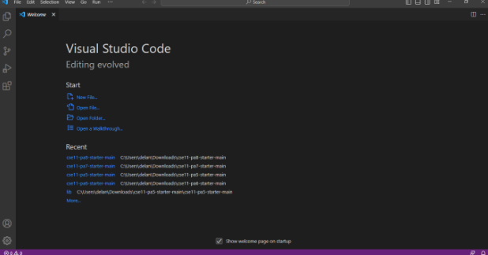
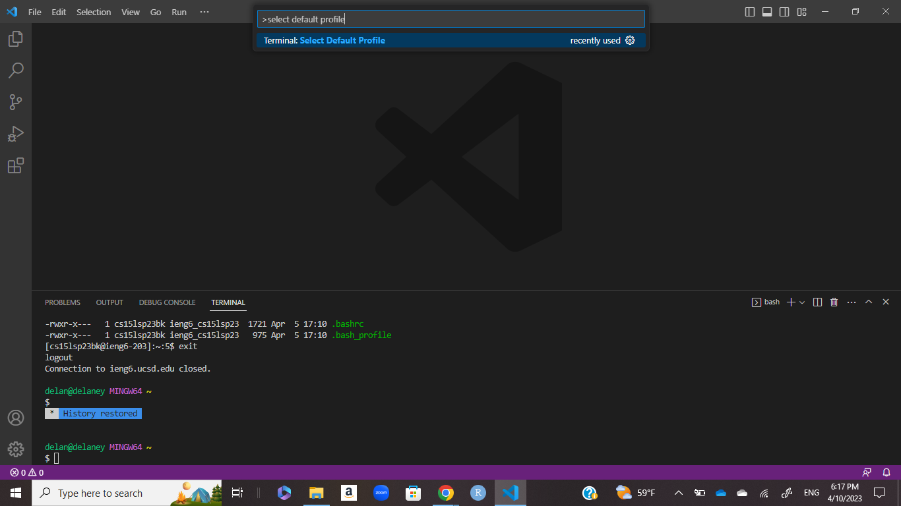
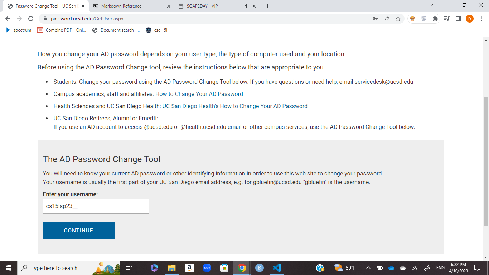
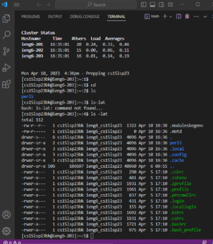

# Remote Access, a step by step tutorial

## Step 1 Installing VS Code

Download [VS Code](https://code.visualstudio.com/) and follow the step by step instructions for your specific system. Once installed, it should look similar to the following. 
After installation, download [Git](https://gitforwindows.org/) for windows and follow the instructions to install. Take care to not change any default settings.

Once both programs are installed open a new terminal in VS Code by clicking `...` in the top bar then `Terminal` or by holding `ctrl` and `'`. Next hold `ctrl` + `shift` + `p` and type select default profile 
Select Git Bash then press `+` in the terminal you previously opened.

## Step 2 Remotely Connecting

Before accessing the network, you need to find your account. Go to [Account Lookup](https://sdacs.ucsd.edu/~icc/index.php). Type in your username and student id. Your course specific account will start with cs. Click the account name and then the change password tool.  **Important**: put your **course specific** username. Wait 15 minutes after creating a password before connecting to the system.

After 15 minutes, go to your terminal in VS Code. Type in 

`ssh yourcourseusername@ieng6.ucsd.edu`

You will then be asked for your password **Important**: your password will not show as you type for privacy reasons. If this is your first time connecting, you will recieve a message. Please type `yes`. You have now successfully connected remotely.

## Step 3 Run Some Commands

Test out some new commands. Try any of the following and see what the result is
* cd ~ 
* cd
* ls -lat
* ls -a
* cp /home/linux/ieng6/cs15lsp23/public/hello.txt~/
* cat /home/linux/ieng6/cs15lsp23/public/hello.txt~/

For example, refer to the following 

If you want to log off the remote server run `exit` in the terminal.
