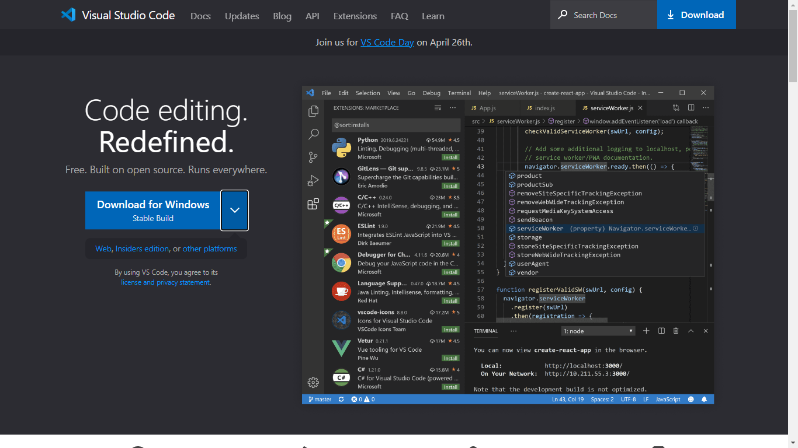

#Remote Access, a step by step tutorial

##Step 1 Installing VS Code

Go to [VS Code](https://code.visualstudio.com/) 

Follow the step by step instructions for your specific system. Once installed, it should look similar to the following. 
