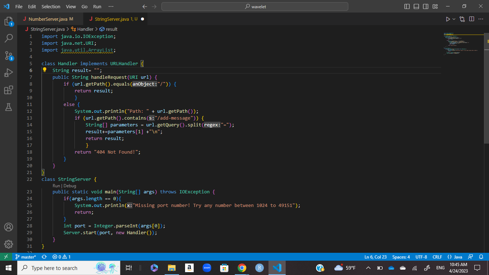
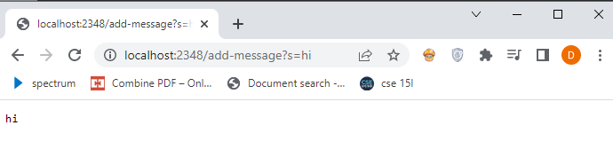
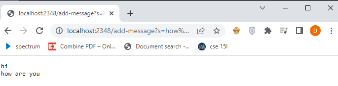
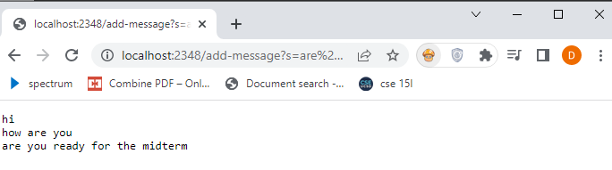

# Lab Report 2
## Part 1
My code was adapted from the number server code in lab:

Running examples, We can see the outcome of adding messages

My code has the method handleRequest within the handler class. The argument for this method is a url. In order to store all the inputs given by the user, we have to start with an empty string which I called `result`. All of my examples have `/add-message` so we ignore the if statement and move to the else statement. We then split the url into two parts at the `=` if `/add-message` is in the url. Everything on the right hand side of the `=` is the message and is added to `result` along with `\n` which is the code for starting a new line. We then return `result` which prints out every phrase in the `result` on a new line.
## Part 2

## Part 3
I feel I have learned a lot in the last 2 labs. I did not know that I could create a server with the limited knowledge I have. I did struggle a bit to create the StringServer and have it work they way I wanted to. I still don't fully understand it, but I got it to run. I thought it was cool to use the remote server and be able to access other people's server.
