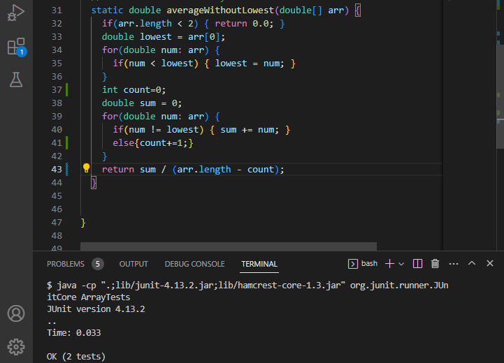

# Lab Report 2
## Part 1
My code was adapted from the number server code in lab:


Running examples, We can see the outcome of adding messages


My code has the method `handleRequest` within the `handler` class. The argument for this method is a url. In order to store all the inputs given by the user, we have to start with an empty string which I called `result`. Looking at the first example, we used `/add-message?s=hi` because `add-message` is present in the url we can skip the if statement and move to the else statement. The url is split at the `=` and everything on the right hand side is added to `result` along with `/n` the code for starting a new line. `result` now has the phrase `hi` which prints on the server. 

We see similar steps with the other examples. The second example has `add-message?s=how%are%you` in the url which accesses the else statement of the `handlerequest` method. Like the previous example, the url is split at the `=` and everything on the right is added to `result`. The contents of `result` has `hi` from the previous exampl and now it has `hi /n how are you /n` which prints in the server. 

The final example has the same trace. The url is split at the `=` and the right hand side is added to `result` which now becomes `hi /n how are you /n are you ready for midterms /n` ehich is printed in the server.
## Part 2
The following code has a bug
```
static double averageWithoutLowest(double[] arr) {
   if(arr.length < 2) { return 0.0; }
    double lowest = arr[0];
    for(double num: arr) {
      if(num < lowest) { lowest = num; }
    }
    double sum = 0;
    for(double num: arr) {
      if(num != lowest) { sum += num; }
    }
    return sum / (arr.length - 1);
  }
  ```
Next, create tests that have a correct output and a failure-inducing input
```
@Test
    public void averageWithoutLowestTest(){
        double [] arr= {0,0,4,5};
        assertEquals(4.5, ArrayExamples.averageWithoutLowest(arr), 0.0001);
      }
 @Test
    public void averageWithoutLowestTest2(){
      double [] arr2= {3,4,4};
      assertEquals(4.0, ArrayExamples.averageWithoutLowest(arr2), 0.0001);
    }
```
When we run these tests we get the following output:

The symptom of this bug is that the result is the wrong answer. In order to fix this we need to account for multiple minimum values.

The following code has gotten rid of the bug:
```
static double averageWithoutLowest(double[] arr) {
    if(arr.length < 2) { return 0.0; }
    double lowest = arr[0];
    for(double num: arr) {
      if(num < lowest) { lowest = num; }
    }
    int count=0;
    double sum = 0;
    for(double num: arr) {
      if(num != lowest) { sum += num; }
      else{count+=1;}
    }
    return sum / (arr.length - count);
  }
```
If we run the tests again, we see that they both pass.

This new code fixes the issue because we keep count of how many of the lowest number there are and then we take that from the length when we find the mean.

## Part 3
I feel I have learned a lot in the last 2 labs. I did not know that I could create a server with the limited knowledge I have. I did struggle a bit to create the StringServer and have it work they way I wanted to. I still don't fully understand it, but I got it to run. I thought it was cool to use the remote server and be able to access other people's server.
