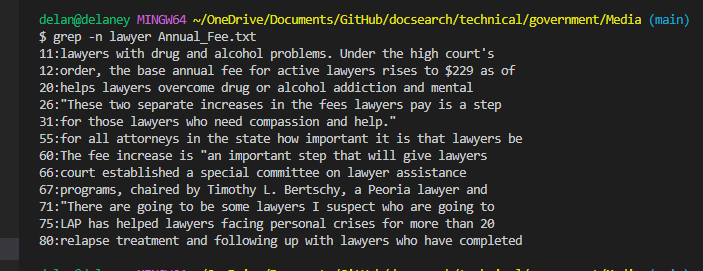

# Lab 3 

For this lab, we will be looking at 4 different uses of the `grep` command. Note that there are more uses apart from these four.
Uses were found using [freecodecamp.org](https://www.freecodecamp.org/news/grep-command-in-linux-usage-options-and-syntax-examples/) 
Within the `docsearch` repository we got from Github, there is a directory called `techincal` and we will be looking at different file within it. 
## Using grep -n
For the first example, we need to access a specific file. I used the following code to access the `Media` directory then used grep -n on one of the file 

```
cd government
cd Media
grep -n Anthem Anthem_Payout.txt
``` 
This code produces the following result.  `Grep` returns all the lines that have the phrase we are looking for in this case it is Anthem. Using `grep -n` returns the line number along with it. 

We can test this code on another file within the `Media` directory. This time we used the following code:
```
grep -n lawyer Annual_Fee.txt
``` 
which produced the following results 
This method is useful when searching for specific phrases that need to be corrected. Because the line number is printed with the line, we can easily identify it within the file. 

## Using grep -v

## Using grep -c

## Using grep -i
