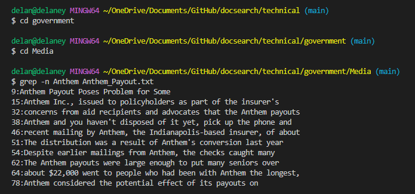
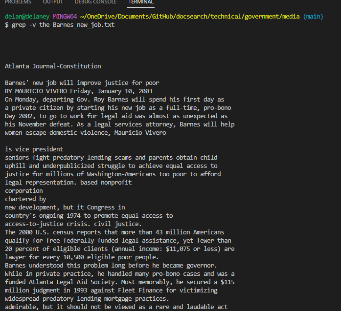

# Lab 3 

For this lab, we will be looking at 4 different uses of the `grep` command. Note that there are more uses apart from these four.
Uses were found using [freecodecamp.org](https://www.freecodecamp.org/news/grep-command-in-linux-usage-options-and-syntax-examples/) 
Within the `docsearch` repository we got from Github, there is a directory called `techincal` and we will be looking at different file within it. 
## Using grep -n
For the first example, we need to access a specific file. I used the following code to access the `Media` directory then used grep -n on one of the file 

```
cd government
cd Media
grep -n Anthem Anthem_Payout.txt
``` 
This code produces the following result.  `Grep` returns all the lines that have the phrase we are looking for in this case it is Anthem. Using `grep -n` returns the line number along with it. 

We can test this code on another file within the `Media` directory. This time we used the following code:
```
grep -n attorney Annual_Fee.txt
``` 
which produced the following results 
This method is useful when searching for specific phrases that need to be corrected. Because the line number is printed with the line, we can easily identify it within the file. 

## Using grep -v

Staying in the same directory `Media` we can look at the uses of `grep -v`. This command inverts the results and returns all lines without the key word. Using:
```
grep -v the Barnes_new_job.txt
```
will return the following result. . As we can see, none of these lines contain the word the. 

We can try looking at files in other directories by using the following code:
```
cd ..
cd ..
cd 911report
grep -v we preface.txt
```
You may notice that some sentences start with We however the w is capitalized while the command has a lowercase. For this reason, uppercase We is not excluded when using `grep -v`. 

## Using grep -i
As we saw in the first example, only lines with `Anthem` were shown using grep and in the fourth example we saw that only lines with `we` were excluded. Now we will look at a method that ignores upper and lowercase. Using the same example as the previous one, we will use the following code to show what occurs when we use `grep` and `grep -i`:
```
grep we preface.txt
grep -i we preface.txt
```
 
When we compare the results, we see that using `-i` will give us any lines with upper or lower case.

We can also look at the results from the first example shown below:

if we run the following code we will get a different result:
```
grep -i Anthem Anthem_Payout.txt
```
## Using grep -c
This command will give the number of occurrences of the given pattern. 
