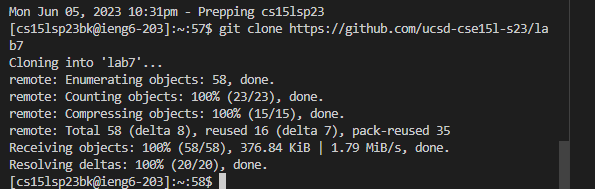
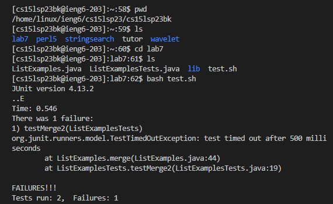
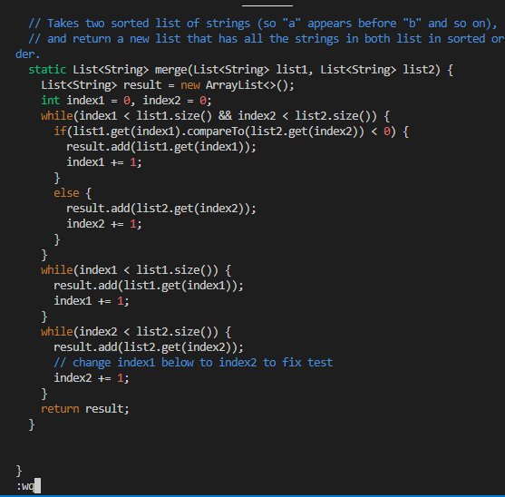
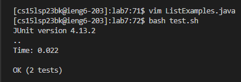
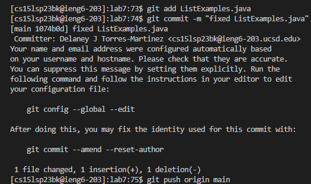

## Lab 4

# Step 4
Log into your ieng6 account. I typed `ssh cs15lsp23bk@ieng6.ucsd.edu` which is my personal account then pressed `<enter>`. I was prompted to enter my password (left out for privacy reasons) and pressed `<enter>` once more. The result should be as following: 

 

# Step 5
To clone a repository, we type the command `git clone` into the command line and then add the url for the desired repository. The url was copied using `<ctrl-c>`and pasted into the command line using `<ctrl-v>`. Lastly `<enter>` was used to finish off the command. The completed command was `git clone https://github.com/ucsd-cse15l-s23/lab7`
The result should be as following:

## Step 6
To check where I was currently at, I used `pwd <enter>` to check the current directory and `ls <enter>` to check the contents of the directory. I want to be in the `lab7` directory, so I used the command `cd lab7 <enter>` to change directories. I ran `ls <enter>` one more time just to double check the contents. After I saw what I wanted, I used `bash test.sh <enter>` to run the sh file. The result was as following:

# Step 7
 Not all tests were passed,so we will now enter Vim to fix the bugs in the code. To enter Vim, I used `vim ListExamples.java <enter>`. The error comes from `index1` being written in the code instead of `index2` at one location. Once in Vim, we can search for the mistake `index1` by using `/index1 <enter>` to search the file. To iterate through all the results of the search, we can press `n`. The error was found on the ninth match so the keys pressed were `nnnnnnnnn`. To edit the code, we need to enter Insert mode by pressing `i`. We can use the right arrow `>` to navigate. I pressed `>>>>>` a total of 6 times. I then changed the `1` to a `2` and entered normal mode by using `<backspace>2<escape>`. To save and quit, I used `:wq<enter>`
The following shows the Vim result before pressing the final `<enter>` 

# Step 8
Next, I will run the tests again to check if they all pass. Because I had previously used `bash test.sh`, I can use `<up><up><enter>` to look at my command history instead of typing the command again. I can now see that all the tests are passed.

# Step 9
Using [panjeh.medium.com](https://panjeh.medium.com/makefile-git-add-commit-push-github-all-in-one-command-9dcf76220f48) for reference, I first use the command `git add L<tab><enter>`. Note that pressing `L<tab>` results in `ListExamples.java` because I had previously typed out the whole file name. I then use `git commit -m "fixed ListExamples.java"<enter>` to push to Github, I used `git push origin main`. Theoretically, this should have worked, but I do not know why I was asked for a username. My research to find a solution has been inconclusive.

 

