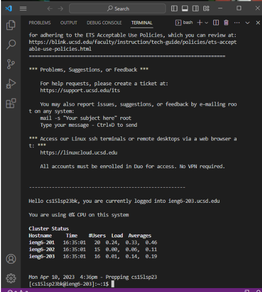

## Lab 4

# Step 4
Log into your ieng6 account. I used `ssh cs15lsp23bk@ieng6.ucsd.edu` then pressed `<enter>`. I was then prompted to enter my password (left out for privacy reasons) and pressed `<enter>` once more. The result should be as following: 
 
